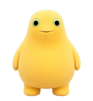

# 奶龙.skills

一个可以直接安装的 Codex 宠物 skill 示例。仓库内置了奶龙宠物的 `spritesheet.webp`、预览图和安装脚本，适合两类用途：

- 直接把奶龙安装成 Codex 桌面端宠物
- 学习如何把自己的角色打包成一个可分发的 Codex pet skill



## 这个仓库包含什么

```text
.
├── SKILL.md                         # Codex skill 入口说明
├── README.md                        # 面向人的安装和教程说明
├── agents/
│   └── openai.yaml                  # Codex UI 展示信息
├── assets/
│   ├── nailong-reference.png        # README 预览图
│   └── nailong-spritesheet.webp     # Codex 宠物动画图集
└── scripts/
    └── install_nailong_pet.py       # 一键安装脚本
```

## 快速使用

克隆仓库：

```bash
git clone https://github.com/notdog1998/nailong-pet-skill.git
cd nailong-pet-skill
```

安装奶龙宠物：

```bash
python scripts/install_nailong_pet.py
```

Windows PowerShell 也可以直接运行：

```powershell
python .\scripts\install_nailong_pet.py
```

脚本会把宠物安装到当前用户的 Codex 宠物目录：

```text
~/.codex/pets/nailong/
  pet.json
  spritesheet.webp
```

安装完成后，重启 Codex，然后打开：

```text
Settings -> Appearance -> Pets -> Select -> 奶龙
```

## 安装为 Codex Skill

如果想让 Codex 自动识别“安装奶龙宠物”这类请求，可以把整个仓库复制到 Codex skills 目录。

macOS / Linux：

```bash
mkdir -p ~/.codex/skills
cp -R nailong-pet-skill ~/.codex/skills/nailong-pet
```

Windows PowerShell：

```powershell
New-Item -ItemType Directory -Force "$env:USERPROFILE\.codex\skills" | Out-Null
Copy-Item -Recurse -Force ".\nailong-pet-skill" "$env:USERPROFILE\.codex\skills\nailong-pet"
```

复制后重启 Codex。之后你可以直接对 Codex 说：

```text
安装奶龙宠物
```

或：

```text
使用奶龙.skills 把宠物装上
```

## 自定义安装名称

默认安装为：

- pet id: `nailong`
- display name: `奶龙`

你也可以自定义：

```bash
python scripts/install_nailong_pet.py --pet-id my-pet --display-name "我的宠物"
```

建议：

- `pet-id` 使用小写英文、数字和连字符
- `display-name` 可以使用中文

## 动作映射

Codex 宠物使用固定的 9 行 spritesheet。这个仓库里的奶龙动作映射如下：

| Codex 状态行 | 奶龙动作 |
|---|---|
| `idle` | 待机 |
| `running-right` | 向右跑，拖动宠物右移时 |
| `running-left` | 向左跑，拖动宠物左移时 |
| `waving` | 开心挥手备用 |
| `jumping` | 完成后开心跳一下 |
| `failed` | 趴下睡觉 |
| `waiting` | 等待输入 |
| `running` | 敲代码中 |
| `review` | 歪头冒问号 |

## 如何改成你自己的宠物

这个仓库也可以当模板使用。

1. 准备一张 Codex 兼容的宠物图集，命名为：

```text
assets/nailong-spritesheet.webp
```

2. 准备一张预览图，命名为：

```text
assets/nailong-reference.png
```

3. 修改 `scripts/install_nailong_pet.py` 里的默认值：

```python
parser.add_argument("--pet-id", default="nailong")
parser.add_argument("--display-name", default="奶龙")
```

4. 修改 `SKILL.md` 和 `agents/openai.yaml` 里的名称、描述和触发词。

5. 运行安装脚本测试：

```bash
python scripts/install_nailong_pet.py --pet-id test-pet --display-name "测试宠物"
```

6. 重启 Codex，在 `Settings -> Appearance -> Pets` 中检查效果。

## 图集规格

Codex 宠物图集使用固定布局：

| 项目 | 值 |
|---|---|
| 总尺寸 | `1536 x 1872` |
| 网格 | `8 columns x 9 rows` |
| 单格尺寸 | `192 x 208` |
| 背景 | 透明 |
| 格式 | `WEBP` |

## 校验 Skill

如果你本机安装了 Codex 的 `skill-creator` 系统 skill，可以校验：

```bash
python ~/.codex/skills/.system/skill-creator/scripts/quick_validate.py .
```

Windows PowerShell：

```powershell
$env:PYTHONUTF8='1'
python "$env:USERPROFILE\.codex\skills\.system\skill-creator\scripts\quick_validate.py" .
```

预期输出：

```text
Skill is valid!
```

## 重新生成宠物资源

这个仓库专注于“分发和安装现成宠物”。如果你要重新生成角色图、重做动作或修复 spritesheet，可以使用 OpenAI curated `hatch-pet` skill 重新制作，然后替换：

```text
assets/nailong-spritesheet.webp
assets/nailong-reference.png
```

## License

MIT
